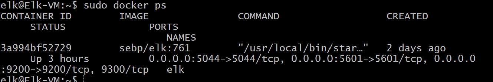

## Automated ELK Stack Deployment

The files in this repository were used to configure the network depicted below.

![https://drive.google.com/file/d/12yGNSj0798di4bFDW-bNox9HYIdkuLpw/view]

These files have been tested and used to generate a live ELK deployment on Azure. They can be used to either recreate the entire deployment pictured above. Alternatively, select portions of the yml file may be used to install only certain pieces of it, such as Filebeat.

---
- name: Configure Elk VM with Docker
  hosts: elk
  remote_user: elk
  become: true
  tasks:
    # Use apt module
    - name: Install docker.io
      apt:
        update_cache: yes
        name: docker.io
        state: present

      # Use apt module
    - name: Install pip3
      apt:
        force_apt_get: yes
        name: python3-pip
        state: present

      # Use pip module
    - name: Install Docker python module
      pip:
        name: docker
        state: present

      # Use command module
    - name: Increase virtual memory
      command: sysctl -w vm.max_map_count=262144

      # Use sysctl module
    - name: Use more memory
      sysctl:
        name: vm.max_map_count
        value: "262144"
        state: present
        reload: yes

      # Use docker_container module
    - name: download and launch a docker elk container
      docker_container:
        name: elk
        image: sebp/elk:761
        state: started
        restart_policy: always
        published_ports:
          - 5601:5601
          - 9200:9200
          - 5044:5044

This document contains the following details:
- Description of the Topologu
- Access Policies
- ELK Configuration
  - Beats in Use
  - Machines Being Monitored
- How to Use the Ansible Build

### Description of the Topology

The main purpose of this network is to expose a load-balanced and monitored instance of DVWA, the D*mn Vulnerable Web Application.

Load balancing ensures that the application will be highly responsive, in addition to restricting traffic to the network.
What aspect of security do load balancers protect? Protect applications from emerging threats athenticate user access, protect against DDOS What is the advantage of a jump box? Protects VM's from the public

Integrating an ELK server allows users to easily monitor the vulnerable VMs for changes to the file system and system metrics.
What does Filebeat watch for? Forwarding and collecting log data
What does Metricbeat record? Collects metics from the system and services running on the server.

The configuration details of each machine may be found below.
_Note: Use the [Markdown Table Generator](http://www.tablesgenerator.com/markdown_tables) to add/remove values from the table_.

| Name     | Function | IP Address | Operating System |
|----------|----------|------------|------------------|
| Jump Box | Gateway  | 10.1.0.9   | Linux            |
| Web 1    |  VM      | 10.1.0.8   | Linux            |
| Web 2    |  VM      | 10.1.0.9   | Linux            |
| ELK      |  VM        10.0.0.4   | Linux            |

### Access Policies

The machines on the internal network are not exposed to the public Internet. 

Only the jumpbox machine can accept connections from the Internet. Access to this machine is only allowed from the following IP addresses:
24.10.211.41

Machines within the network can only be accessed by Jumpbox.
Jump Box 10.1.0.9

A summary of the access policies in place can be found in the table below.

| Name     | Publicly Accessible | Allowed IP Addresses |
|----------|---------------------|----------------------|
| Jump Box |     No              | 24.10.211.41         |
|          |                     |                      |
|          |                     |                      |

### Elk Configuration

Ansible was used to automate configuration of the ELK machine. No configuration was performed manually, which is advantageous because no human error. Decreases time and increases efficiency.
What is the main advantage of automating configuration with Ansible?Decreases time and increases efficiency.

The playbook implements the following tasks:
: In 3-5 bullets, explain the steps of the ELK installation play. E.g., install Docker; download image; etc._

Install docker
Install python
Install memory
Launch elk container

The following screenshot displays the result of running `docker ps` after successfully configuring the ELK instance.

### Target Machines & Beats
This ELK server is configured to monitor the following machines
List the IP addresses of the machines you are monitoring_

10.1.0.7
10.1.0.8

We have installed the following Beats on these machines:
Specify which Beats you successfully installed

Kabana
Elasticsearch

These Beats allow us to collect the following information from each machine:

Elasticsearch allows you to store and search volumes of data in real time. Kabana log analystics.

### Using the Playbook
In order to use the playbook, you will need to have an Ansible control node already configured. Assuming you have such a control node provisioned: 

SSH into the control node and follow the steps below:
- Copy the ssh key file to jumpbox.
- Update the ansible host file to include the elk vm
- Run the playbook, and navigate to elk conatiner to check that the installation worked as expected.

Answer the following questions to fill in the blanks:_
- _Which file is the playbook? A file which contains a series of tasks on a remote server Where do you copy it? Create a yml file to copy it
- _Which file do you update to make Ansible run the playbook on a specific machine? Host How do I specify which machine to install the ELK server on versus which to install Filebeat on? You name it in the host section
- _Which URL do you navigate to in order to check that the ELK server is running?  http://52.138.80.168:5601/app/kibana

_As a **Bonus**, provide the specific commands the user will need to run to download the playbook, update the files, etc._